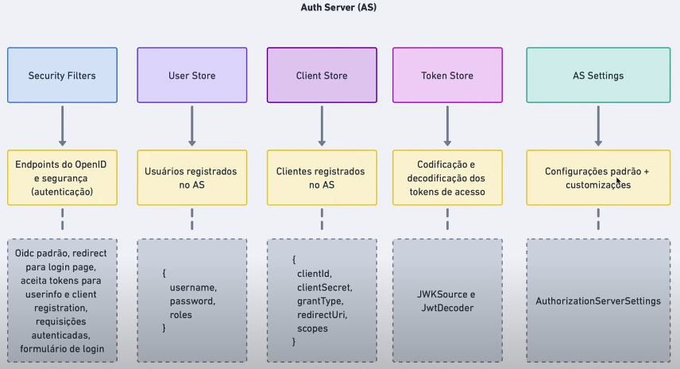
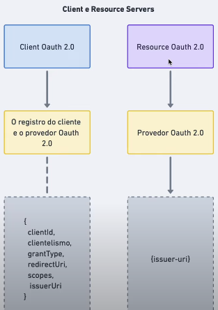

<h1 align="center">
  Auth Server
</h1>

  <a href="#-tecnologias">Tecnologias</a>&nbsp;&nbsp;&nbsp;|&nbsp;&nbsp;&nbsp;
  <a href="#-como-executar">Como executar</a>&nbsp;&nbsp;&nbsp;|&nbsp;&nbsp;&nbsp;

<h2 align="center">
  
</h2>

<h2 align="center">
  
</h2>

<h2 align="center">
  
</h2>
 

## ✨ Tecnologias

Esse projeto foi desenvolvido com as seguintes tecnologias:

- [Spring Authorization Server](https://spring.io/projects/spring-authorization-server)
- [Spring Boot](https://spring.io/projects/spring-boot)
- [Spring Security](https://spring.io/projects/spring-security)

## 🚀 Como executar

- Clone o repositório
- Abra em qualquer IDE Java
- Execute o projeto Spring Boot

Agora você pode testar os seguintes fluxos seguindo a implementação do OIDC:

- Acesse `http://localhost:8080/home`
- Autentique com o usuário `user` e senha `password`
- Aceite as opções de consentimento
- Visualize os dados gerados pelo AS (access token, refresh token e id token)
- Acesse `http://localhost:8080/tasks`
- Visualize as tarefas do usuário logado

---